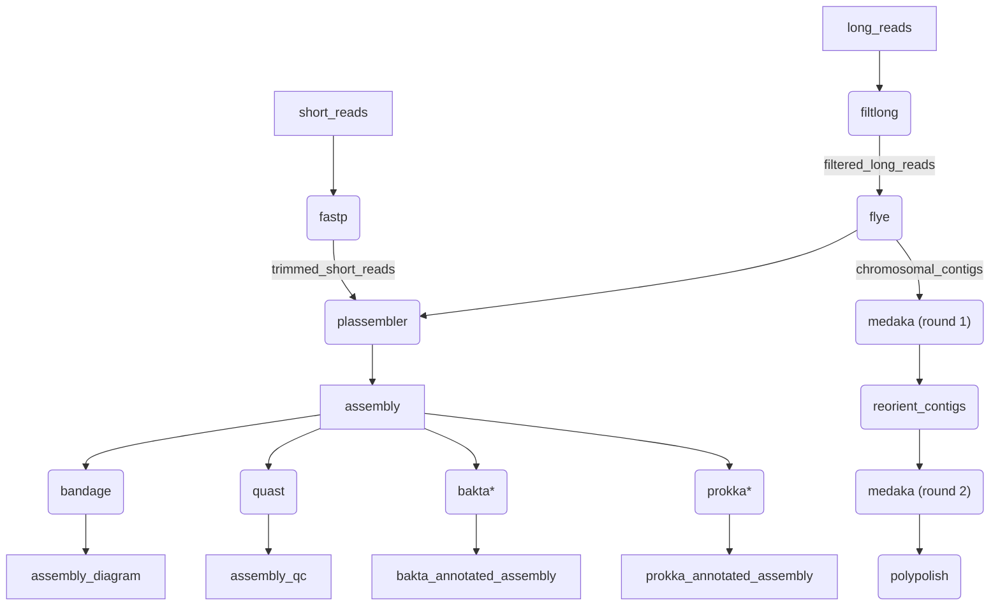

[](https://github.com/BCCDC-PHL/plasmid-assembly/actions/workflows/tests.yml)

# plasmid-assembly

A pipeline for high-quality plasmid assemblies. This pipeline is largely based on [hybracter](https://github.com/gbouras13/hybracter).

Optionally annotate genes. Collects quality info on both incoming and outgoing datasets. 


\*Optional processes

## Analyses

* Read trimming & QC: [fastp](https://github.com/OpenGene/fastp) and [filtlong](https://github.com/rrwick/Filtlong)
* Genome Assembly: [plassembler](https://github.com/gbouras13/plassembler) (long reads, or hybrid)
* Gene Annotation: [prokka](https://github.com/tseemann/prokka) or [bakta](https://github.com/oschwengers/bakta)
* Assembly QC: [quast](https://github.com/ablab/quast), [bandage](https://github.com/rrwick/bandage)

## Usage

By default, plassembler will be used, and no gene annotation will be run:
```
nextflow run BCCDC-PHL/plasmid-assembly \
  --fastq_input <short-read fastq input directory> \
  --fastq_input_long <long-read fastq input directory> \
  --outdir <output directory>
```


Prokka and/or bakta can be used with the `--prokka` and `--bakta` flags:
```
nextflow run BCCDC-PHL/plasmid-assembly \
  --fastq_input <short-read fastq input directory> \
  --fastq_input_long <long-read fastq input directory> \
  --prokka \
  --bakta \
  --outdir <output directory>
```


The pipeline also supports a 'samplesheet input' mode. Pass a `samplesheet.csv` file with the headers `ID`, `R1`, `R2`,`LONG`:
```
nextflow run BCCDC-PHL/dragonflye-nf \
  --samplesheet_input <samplesheet.csv> \
  --outdir <output directory>
```

Eg:
```
ID,R1,R2,LONG
sample-01,/path/to/sample-01_R1.fastq.gz,/path/to/sample-01_R2.fastq.gz,/path/to/sample-01_RL.fastq.gz
sample-02,/path/to/sample-02_R1.fastq.gz,/path/to/sample-02_R2.fastq.gz,/path/to/sample-02_RL.fastq.gz
sample-03,/path/to/sample-03_R1.fastq.gz,/path/to/sample-03_R2.fastq.gz,/path/to/sample-03_RL.fastq.gz
```


## Output

(Note: this section is currently incomplete. Will be updated as output files are finalized)

An output directory will be created for each sample under the directory provided with the `--outdir` flag. The directory will be named by sample ID, inferred from
the fastq files (all characters before the first underscore in the fastq filenames), or the `ID` field of the samplesheet, if one is used.

If we have `sample-01_R{1,2}.fastq.gz`, in our `--fastq_input` directory, the output directory will be:

```
sample-01
├── sample-01_20211125165316_provenance.yml
├── sample-01_fastp.csv
├── sample-01_fastp.json
├── sample-01_plassembler_hybrid.fa

```

### Provenance files
For each pipeline invocation, each sample will produce a `provenance.yml` file with the following contents:

```yml
- pipeline_name: BCCDC-PHL/plasmid-assembly
  pipeline_version: 0.1.0
- timestamp_analysis_start: 2022-08-16T13:22:11.553143
- input_filename: sample-01_R1.fastq.gz
  sha256: 4ac3055ac5f03114a005aff033e7018ea98486cbebdae669880e3f0511ed21bb
  file_type: fastq-input
- input_filename: sample-01_R2.fastq.gz
  sha256: 8db388f56a51920752319c67b5308c7e99f2a566ca83311037a425f8d6bb1ecc
  file_type: fastq-input
- process_name: fastp
  tools:
    - tool_name: fastp
      tool_version: 0.23.1
- process_name: plassembler
  tools:
    - tool_name: plassembler
      tool_version: 1.4.1
- process_name: prokka
  tools:
    - tool_name: prokka
      tool_version: 1.14.5
      parameters:
        - parameter: --compliant
          value: null
- process_name: quast
  tools:
    - tool_name: quast
      tool_version: 5.0.2
      parameters:
        - parameter: --space-efficient
          value: null
        - parameter: --fast
          value: null
```

The filename of the provenance file includes a timestamp with format `YYYYMMDDHHMMSS` to ensure that re-analysis of the same sample will create a unique `provenance.yml` file.
